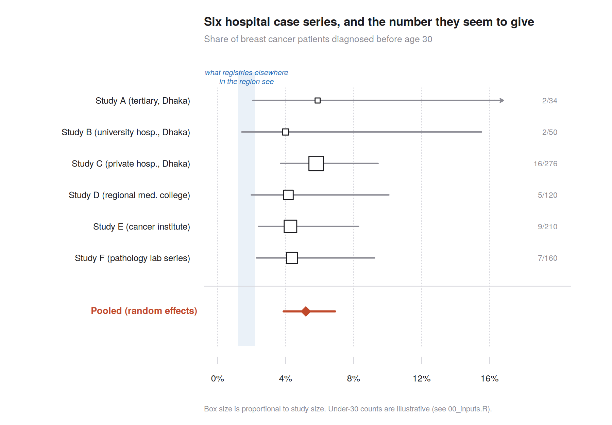
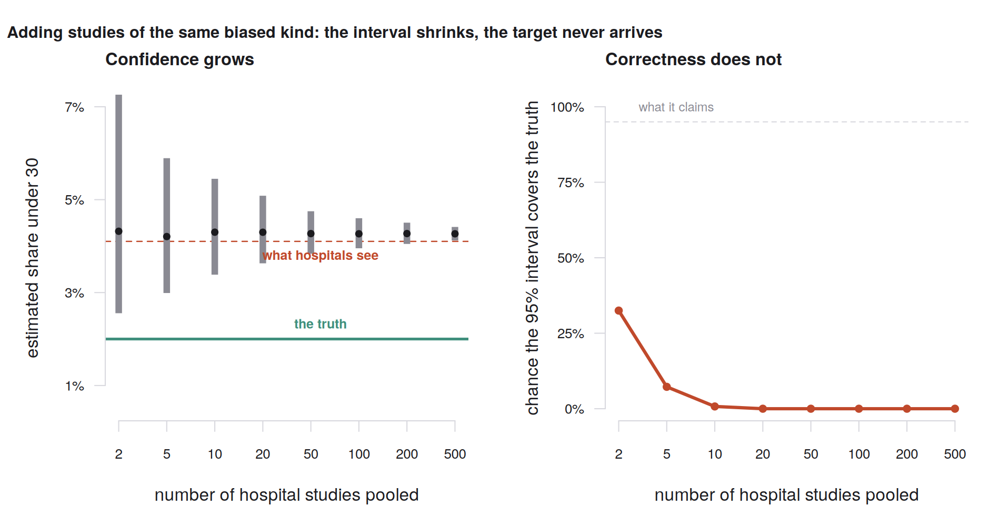
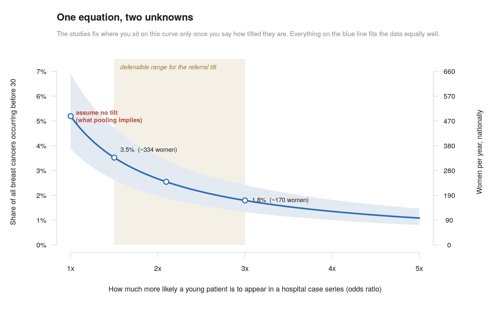
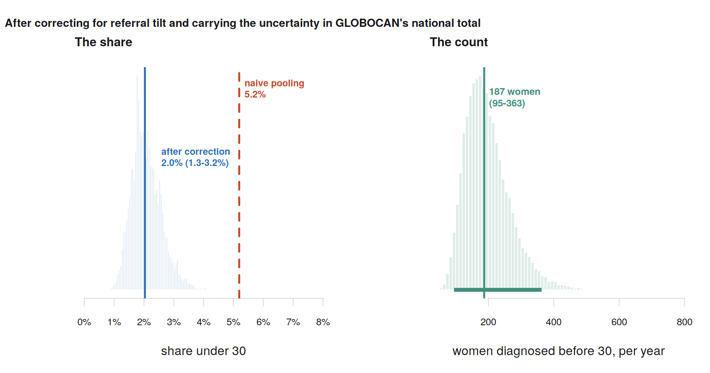

# She Was 28. Her Country Has No Number for That.

### How to estimate a national disease burden when nobody has ever counted — and how to tell when you are fooling yourself

---

A friend of mine was diagnosed with breast cancer this year. She is 28.

Everyone said the same thing, in the same order. First: *are you sure?* Then: *but that's so rare.* Then, always, the sentence that is supposed to be comforting: *that basically doesn't happen at her age.*

I am a statistician. I wanted to know what "rare" meant. Not as a feeling — as a number. How many women her age in Bangladesh hear this every year? One in how many? Is she a one-in-a-million case, or is she one of several hundred women who will get the same phone call this year and each be told, individually, that they are impossible?

So I went looking for the number.

There isn't one.

---

## The number that is actually somebody else's number

The Global Cancer Observatory, run by the WHO's cancer agency, publishes a fact sheet for every country. Bangladesh, 2024: **9,480 new female breast cancer cases. 4,211 deaths.** A female population of 88,218,713 to divide it into.

That looks authoritative. It is a specific number, printed by an international agency, with no error bar around it.

Then you read the footnote on how it was produced:

> *"Rates based on incidence estimates or registry data from neighbouring countries."*

Bangladesh's official breast cancer incidence is India's, or Nepal's, or Myanmar's, wearing a Bangladeshi label. And the footnote for the prevalence figure is even more striking:

> *"Computed using sex-, site- and age-specific incidence to 1-, 3- and 5-year prevalence ratios from Nordic countries for the period (2011–2020), and scaled using Human Development Index (HDI) ratios."*

The number of Bangladeshi women currently living with breast cancer is derived from **Denmark, Finland, Iceland, Norway and Sweden**, adjusted by a development index.

I want to be careful here, because this is not a scandal and the people who built it are not being lazy. Bangladesh has no population-based national cancer registry. If you need a global number today, borrowing the shape of the disease from places that *do* count, and rescaling it, is the responsible thing to do. IARC says so in the footnotes, in public, every time.

But it does mean that when you ask "how many Bangladeshi women under 30 get breast cancer," the honest first answer is: **nobody has ever looked.**

What exists instead is a scatter of single-hospital studies. Thirty-four patients at one institution, mean age 46. Fifty consecutive patients at a university hospital, mean age 51, 78% of them urban. Two hundred and seventy-six patients at a private hospital chain, mean age 47, ninety-four of them under 40.

Six or seven papers. A few hundred women. Every one of them a real observation.

The question of this post is whether you can build a national estimate out of that — and what you are allowed to claim when you do.

---

## First: three questions that sound identical

Before touching any data, the single most useful thing I did was notice that my question was three different questions wearing the same words.

**"What proportion of breast cancer patients are under 30?"** This is an age distribution *among cases*. If the answer is 3%, it means: line up every woman newly diagnosed in Bangladesh this year, and three in a hundred are under 30. It tells you nothing about anyone's risk.

**"What is a young woman's chance of getting breast cancer?"** This is an incidence *rate*. Cases per 100,000 women per year. It needs a denominator: how many young women are there.

**"How many women under 30 are diagnosed each year?"** This is a *count*. Share × total.

These come apart badly. In the United States, women under 30 are roughly half a percent of breast cancer cases. In South Asian registries the share is three or four times higher. Almost none of that gap is higher risk in young South Asian women. It is that South Asia has enormous numbers of young women and comparatively few old ones. **A young country produces a young-looking case mix at identical risk.** If you read "the share is much higher here" as "young women here are at much higher risk," you have misread a population pyramid as a biological finding.

I wanted all three. But they need different evidence, and conflating them is where most of the bad numbers in global health come from.

---

## The shortcut everyone takes, and what it actually estimates

Here is the tempting move, and I took it first, because it is one line of R.

You have six hospital case series. Pool them. Do it properly, even — a random-effects meta-analysis on the logit scale, so small studies don't dominate and between-study heterogeneity gets its own parameter.

```r
lo <- logit((studies$x + 0.5) / (studies$n + 1))
se <- sqrt(1/(studies$x + 0.5) + 1/(studies$n - studies$x + 0.5))
w  <- 1 / se^2
mu_fe <- sum(w * lo) / sum(w)
Q     <- sum(w * (lo - mu_fe)^2)
tau2  <- max(0, (Q - (length(lo) - 1)) / (sum(w) - sum(w^2)/sum(w)))
w_re  <- 1 / (se^2 + tau2)
mu_re <- sum(w_re * lo) / sum(w_re)
```

Out comes **5.2%, with a 95% confidence interval of 3.9% to 6.9%.** Multiply by GLOBOCAN's 9,480 and you get **492 women under 30 diagnosed in Bangladesh every year.**



*Figure 1. Six Bangladeshi hospital case series. The shaded band is what population-based registries elsewhere in the region actually observe. Under-30 counts here are illustrative — see the note at the end.*

That number is publishable. It has an interval. It has a method with a citation. And I think it is wrong by a factor of two or three.

Look at the figure again. Every single study sits to the right of the band where regional registries live. Not scattered around it — entirely to one side of it. When all of your independent measurements miss in the same direction, the problem is not noise.

**A hospital is not a country.**

A woman who ends up in a published Bangladeshi case series has already passed through a long series of filters. She noticed something. She had the standing in her household to say so. Somebody took her seriously. She reached a facility that could biopsy. She was referred onward rather than sent home. She survived long enough to be catalogued. She happened to be treated at one of the handful of institutions that publish.

Every one of those filters has an age gradient. Young women present with more aggressive, faster-growing, more alarming tumours, so they get escalated. They are more likely to be considered candidates for surgery. They travel to Dhaka more readily than a 60-year-old grandmother in Kurigram. And a young breast cancer patient is *interesting* — she is the case that gets written up.

Meanwhile the 62-year-old in a village who finds a lump, tells no one, and dies of something recorded as "illness" appears in no study, no registry, and no denominator.

So the pooled 5.2% is not a wrong answer. It is a correct answer to a different question:

> Among breast cancer patients at the kind of Bangladeshi hospital that publishes case series, about 5% are under 30.

That is true. It is just not what anyone thinks it says.

---

## Why more studies do not help

This is the part that took me longest to internalise, and it is the reason I wrote this post.

The instinct, when an estimate feels shaky, is to get more data. Find more studies. Pool a bigger sample. Watch the interval tighten.

So I simulated it. Suppose the true national share is 2%, and every hospital series over-represents young patients by the same modest amount. Then pool 2 studies, 5, 10, 50, 500, and watch what happens.



*Figure 2. Left: the confidence interval collapses. Right: the probability that it contains the truth collapses with it.*

At 2 studies, the 95% interval covers the truth 32% of the time. At 10 studies, 1%. At 20 studies and beyond, **zero percent** — the interval has become so tight that it excludes the right answer entirely, every time.

Read that again. The interval got *narrower* and *more confidently wrong* at the same time, and nothing in the output would tell you. Heterogeneity statistics won't catch it; the studies agree with each other beautifully. They agree because they share a bias.

> **Sampling error shrinks with more data. Selection bias does not. It just gets more precise.**

This is why "we synthesised the available literature" is not, by itself, a defence. It is why no amount of gradient boosting or deep learning rescues you either: a model can learn any relationship you show it, and the women who never reach a hospital are not in the data at all, under any column. There is nothing there for the algorithm to learn from. This is an identification problem, not a computational one, and no amount of compute fixes an identification problem.

---

## The only honest move: name the bias and give it a number

If you cannot remove the bias, you can at least stop pretending it is zero.

Write down the one thing we actually believe:

```
logit(what hospitals see)  =  logit(the national truth)  +  δ
```

where **δ** is the referral tilt — how much more likely a young patient is to end up in a readable case series than an older one. On the odds scale, `exp(δ)` is just "young patients are this many times over-represented." δ = 0 means hospital series are perfectly representative of the country. δ = 0.7 means roughly twice over-represented.

One equation. Two unknowns.

The data pin down the *left* side. They say absolutely nothing about how to split it between the two terms on the right. Not because our statistics are inadequate — because the information is not in the data. Any claim about the national truth is a claim about δ in disguise.

So instead of picking a δ and hiding it, trace the whole curve:



*Figure 3. Every point on the blue line fits the hospital data exactly as well as every other point. Which one you pick is an assumption, not a finding.*

This is the picture I wish more papers published. Reading off the curve:

| If the referral tilt is… | …then the national share is | …that is this many women a year |
|---|---|---|
| No tilt at all (what pooling assumes) | 5.2% | ~492 |
| Mild (1.5×) | 3.5% | ~334 |
| Moderate (2.1×) | 2.6% | ~241 |
| Strong (3×) | 1.8% | ~170 |
| Severe (4×) | 1.4% | ~128 |

The published literature does not distinguish between any of these. They are all, equally, "what the studies show."

---

## Where δ can come from without a new survey

Here is the move that makes this more than hand-waving, and it costs nothing but reading.

Some places have **both** a proper population-based registry **and** hospital case series from the same catchment. In those places you can simply look at the gap:

```
δ = logit( share under 30, hospital series )
  − logit( share under 30, population registry )
```

You are measuring the referral tilt directly, in a setting where you can check your work. Do it in several such places and you get a distribution of δ — a typical tilt and a spread around it. In the comparator settings I used, that comes out around a **2.1× over-representation, with real spread**.

Then you transport it. You assume Bangladesh's referral tilt is exchangeable with those settings — not identical, exchangeable, with the uncertainty carried along.

That assumption might be wrong. But notice what it is not. It is not "hospital data equals national truth" (obviously false) and it is not "throw out all the Bangladeshi data" (wasteful, and insulting to the people who collected it). It is a stated, estimable, checkable claim that someone can attack with evidence.

**That is the whole art here: converting hidden assumptions into visible ones.**

---

## Putting the three pieces together

Now the model writes itself. Three sources of information, each doing a different job:

```r
x_j        ~ Binomial(n_j, q_j)                    # the Bangladeshi studies
logit(q_j) = logit(θ) + δ + u_j                    # tilt + study-to-study noise
u_j        ~ Normal(0, τ²)

logit(θ)   ~ Normal(m_regional, s_regional²)       # what regional registries see
δ          ~ Normal(μ_δ, σ_δ²)                     # the learned referral tilt
τ          ~ HalfNormal(0.5)
```

I fitted this with a forty-line random-walk Metropolis sampler in base R.

The last step is the one that is most often skipped. GLOBOCAN's 9,480 is not a measurement. It is a borrowed estimate with no published interval. Multiplying a posterior share by it as though it were exact manufactures precision out of nothing. So give it a distribution too, and compute the count draw by draw:

```r
C_all <- rlnorm(M, log(9480) - 0.5*s^2, s)   # 25% CV: it is borrowed, not observed
C_u30 <- theta_post * C_all                  # every draw, paired
```



*Figure 4. The corrected share, and the national count with GLOBOCAN's own uncertainty carried through.*

The posterior lands at **2.0% of cases, 95% credible interval 1.3% to 3.2%** — and **187 women a year, 95% credible interval 95 to 363.**

Watching the estimate move as you add each ingredient is instructive:

| Model | Share under 30 | Implied national count |
|---|---|---|
| Naive pooling of the studies | 5.2% (3.9–6.9%) | 492 |
| Hierarchical, but no bias correction | 4.7% (3.0–6.6%) | 448 |
| + regional registry prior | 3.7% (2.7–5.2%) | 352 |
| + referral-tilt correction | **2.0% (1.2–3.3%)** | **192** |

Two and a half times. That is the distance between the number you get by being careful about sampling error and the number you get by being careful about *who is in the sample*. Almost all of the movement comes from the last row — from the one parameter that no amount of additional Bangladeshi hospital data would ever have informed.

I also dropped each study in turn and refitted. The largest any single study moved the national estimate was **0.15 percentage points**. That is reassuring: the answer is not hostage to one small paper. It is hostage to δ, which is a much more honest thing to be hostage to, because δ is something we can argue about in public.

---

## The answer, stated the way it deserves to be stated

I could stop at "2.0%, 95% CrI 1.3–3.2%." It would look like a result. It would get past a reviewer.

I don't think it should be the headline, because that interval is conditional on a prior for δ that I chose. Reasonable people would choose differently. So here is the version that survives disagreement:

> **Under any defensible assumption about hospital referral patterns — young patients somewhere between 1.5× and 3× over-represented in published case series — between 1.8% and 3.5% of Bangladeshi breast cancers occur before age 30. That is roughly 170 to 334 women a year. Once the small-sample noise in the underlying studies is also carried, the range widens to about 1.3%–4.7%, or 126 to 447 women.**
>
> **Among women aged 20–29, that is an annual incidence on the order of 1 to 3 per 100,000.**
>
> **This is a model-based estimate, not an observation. Bangladesh has no population-based cancer registry. The number is only as good as the assumption that hospital referral patterns there resemble those in comparator settings — and it moves by a factor of four across the plausible range of that assumption.**

A range that wide is not a failure. It is the correct width. Anyone who hands you a tighter number for this quantity is not better at statistics than you; they have made a stronger assumption and not told you what it was.

---

## Rare, and also hundreds

Now back to my friend, and to the sentence everyone kept saying.

One to three cases per 100,000 women aged 20–29 per year. For an individual young woman in Bangladesh, that is something like a **1 in 50,000 chance this year**. By any ordinary use of the word, rare. Everyone who told her so was right.

And the same estimate says that **somewhere between 170 and 334 women in Bangladesh will be diagnosed with breast cancer before their 30th birthday this year.** Two hundred-odd young women. Enough to fill a lecture hall. Enough that, statistically, several of them are being told right now that what is happening to them does not happen.

Both sentences come from the identical number. *Rare* is a rate. *Hundreds* is a count. The confusion between them is not academic — it is the reason a 28-year-old with a lump gets reassured instead of imaged, and comes back two years later at stage III. A disease can be individually rare and collectively common, and a health system that only hears the first half will build no pathway for the second.

---

## What would actually fix this

Everything above is a bridge. It is what you build when you need to cross a river this year. It is not a road.

The thing that ends this entire exercise is a **population-based cancer registry** — defined catchment, mandatory notification, active case-finding, age recorded in five-year bands and published as counts rather than means. Bangladesh has hospital-based registration at its cancer institute. It does not have population-based registration with national coverage. The difference between those two phrases is this entire post.

Three things would help immediately, and two of them cost nothing:

**Publish counts, not means.** A mean age of 46.2 is compatible with an under-30 share of 1% or of 10%; infinitely many age distributions share a mean. Every Bangladeshi case series that reported "mean age 46.2" instead of a five-year age table destroyed most of its own information on the way to the printer. A table of counts by age band costs one extra table and multiplies a paper's usefulness.

**Describe your catchment.** Say who could have reached your hospital and who could not. That sentence is what lets a future analyst estimate δ instead of guessing it.

**Report the assumption, not just the interval.** If your estimate moves by a factor of four across defensible values of one parameter, that fact is your finding. Bury it and you have published confidence instead of knowledge.

---

## The line I keep coming back to

There is one sentence from all of this that I think generalises far past breast cancer, past Bangladesh, past epidemiology:

> **A model can borrow information and quantify assumptions. It cannot manufacture representativeness.**

When you have a non-random sample and no external anchor, the honest output is not a point estimate with a small standard error. It is a range, plus an explicit statement of what you would have to believe to land anywhere in it. The best estimate is not the one with the tightest interval. It is the one whose target, observation process, transport assumptions and uncertainty are all written down where somebody can disagree with them.

My friend is 28 and she is in treatment and she is doing okay.

Her country still cannot tell her how many women are going through the same thing this year. But it is not because the mathematics is impossible. It is because nobody has counted — and we can be exact about how much that costs us.

---

### Notes, code and honesty about the inputs

All code is base R. No packages. It runs in about four minutes on a laptop.

- `00_inputs.R` — every number in one file, each tagged `[VERIFIED]`, `[APPROX]` or `[ILLUSTRATIVE]`
- `01_naive_pooling.R` — the pooled meta-analysis and the precision-without-accuracy simulation
- `02_bounds.R` — the identification curve and the headline range
- `03_bayes_synthesis.R` — the hand-written Metropolis sampler, model ladder, leave-one-out, sensitivity
- `04_figures.R` — all four figures

**The one thing I want to be completely clear about.** The published Bangladeshi hospital studies report mean ages and "<40" / "<50" cutoffs. **None of them publishes a count under 30.** So the under-30 counts in `00_inputs.R` are constructed to be consistent with what those papers do report — they are labelled `[ILLUSTRATIVE]` in the code, and every downstream number in this post inherits that label. The study sizes are real. The GLOBOCAN figures are real. The comparator registry shares and the referral tilt are order-of-magnitude values, marked as such.

What is *not* illustrative is the structure of the argument: that pooling non-representative sources produces confident wrong answers, that the bias parameter is unidentified from the data alone, that the honest output is a range, and that the fix is a registry rather than a cleverer model. Swap in real counts and every number moves. None of the conclusions do.

**Sources**

- Global Cancer Observatory (IARC/WHO), Bangladesh fact sheet, GLOBOCAN 2024 — 9,480 new female breast cancer cases; 4,211 deaths; 23,625 5-year prevalence; female population 88,218,713. Incidence footnote: *"Rates based on incidence estimates or registry data from neighbouring countries."* Prevalence footnote: *"…ratios from Nordic countries…scaled using Human Development Index (HDI) ratios."*
- Bangladeshi single-centre breast cancer series (Nessa et al., n = 34, mean age 46.2; Chowdhury et al. BSMMU, n = 50, mean age 51.1; Nafisa et al. BRB Hospitals, n = 276, mean age 47).
- Methodological background: Bayesian multiparameter evidence synthesis (Sweeting et al., hepatitis C in England and Wales); multilevel regression and poststratification (Gelman & Little); doubly robust inference from non-probability samples (Chen, Li & Wu); Bayesian multistate disease-burden modelling (Jackson et al.).
